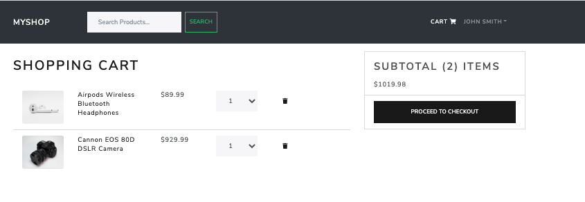
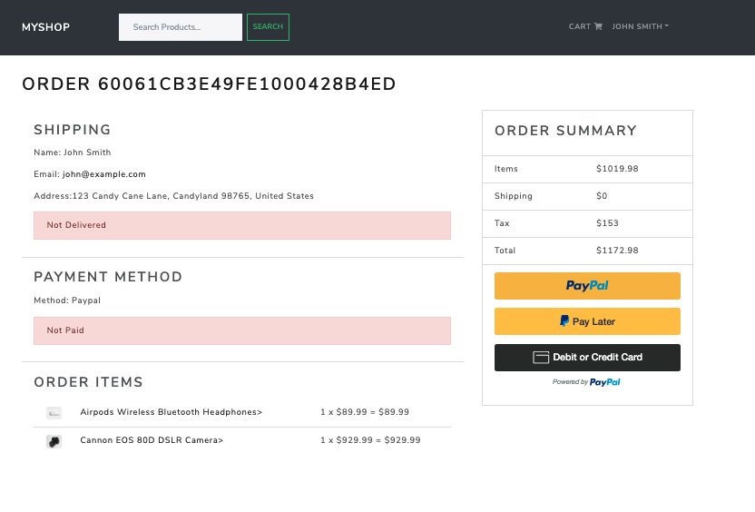
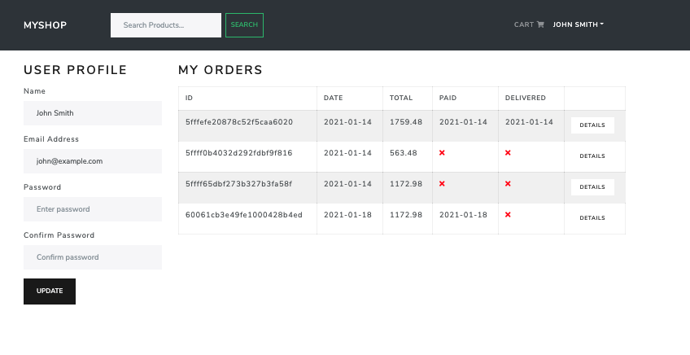
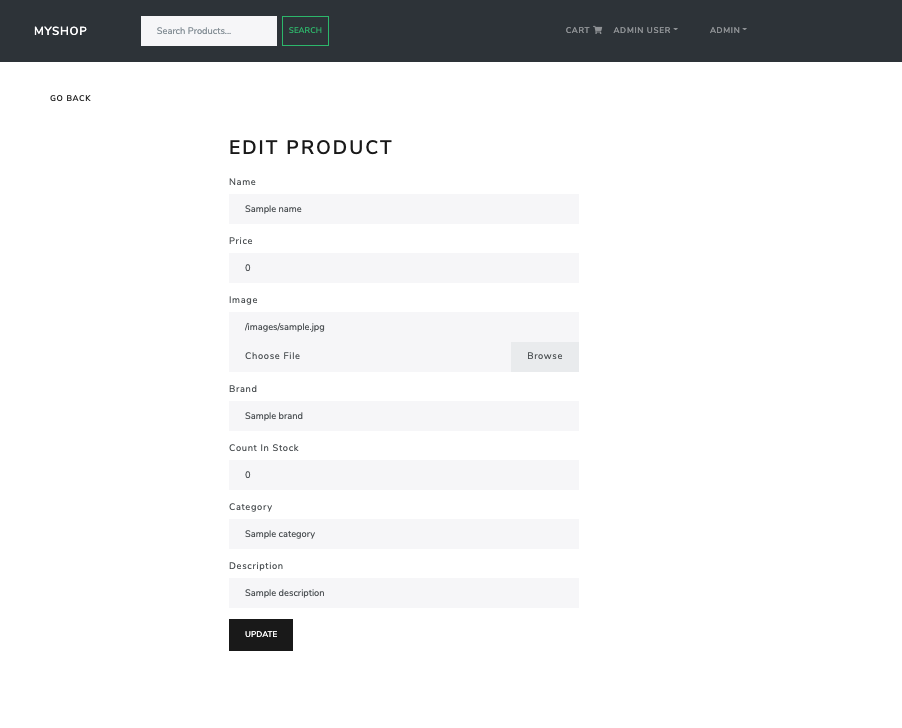
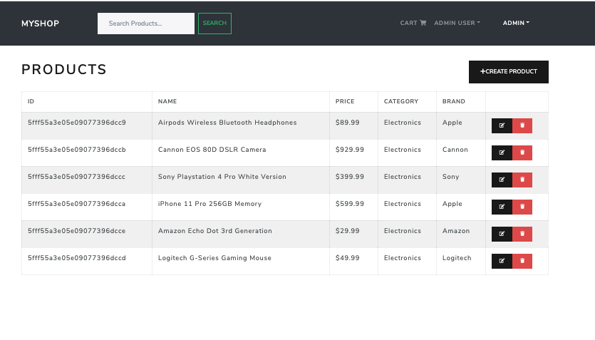
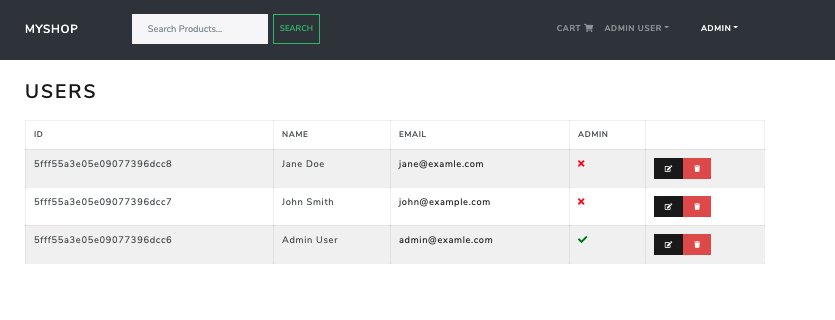

# MyShop - An eCommerce Site

## Overview

https://myshop42.herokuapp.com/

This application serves as an fully functioning eCommerce website. Users can browse products, create profiles, purchase products using paypal or thei debit and credit cards, and leave reviews. Admins can can add or remove products, manage users, and manage orders. 

## Table of Contents
    
* [UserStory](#UserStory)
* [Usage](#usage)
* [ScreenShots](#Screenshots)
* [License](#license)
* [Badges](#badges)

## User Story
AS an online shop owner
I WANT a fully-functional website
SO THAT users can purchase my products
AND I can manage my inventory, users, and orders

## Usage 

The user is presented with the home page where they can browse through products, read reviews, and add products to their cart. When the user is ready to purchase, they will be prompted to register. Once the user has created an account they can login and proceed with their order. They will be prompted to enter their shipping information and payment prefernce. From there they will be taken to the payment page where their order summary will be presented to them and they will be able to pay through paypal or debit or credit, and a payment confirmation will be presented to them. Users also have the option to go to their pofile and edit their info as well as view their orders and check if they have been delivered. Users can later leave a rating and a review of the products they've purchased. 

Admins of the application have the ability to add, delete, and update products. They can also manage users and orders. When an order has been fulfilled and the customer has paid, the admin will have the ability to mark an order as 'out for delivery' to update the customer.

## Screenshots

## License
    
MIT License

Copyright (c) 2020 Christine Ross
        
Permission is hereby granted, free of charge, to any person obtaining a copy
of this software and associated documentation files (the "Software"), to deal
in the Software without restriction, including without limitation the rights
to use, copy, modify, merge, publish, distribute, sublicense, and/or sell
copies of the Software, and to permit persons to whom the Software is
furnished to do so, subject to the following conditions:
        
The above copyright notice and this permission notice shall be included in all
copies or substantial portions of the Software.
        
THE SOFTWARE IS PROVIDED "AS IS", WITHOUT WARRANTY OF ANY KIND, EXPRESS OR
IMPLIED, INCLUDING BUT NOT LIMITED TO THE WARRANTIES OF MERCHANTABILITY,
FITNESS FOR A PARTICULAR PURPOSE AND NONINFRINGEMENT. IN NO EVENT SHALL THE
AUTHORS OR COPYRIGHT HOLDERS BE LIABLE FOR ANY CLAIM, DAMAGES OR OTHER
LIABILITY, WHETHER IN AN ACTION OF CONTRACT, TORT OR OTHERWISE, ARISING FROM,
OUT OF OR IN CONNECTION WITH THE SOFTWARE OR THE USE OR OTHER DEALINGS IN THE
SOFTWARE.
    
## Badges
    
